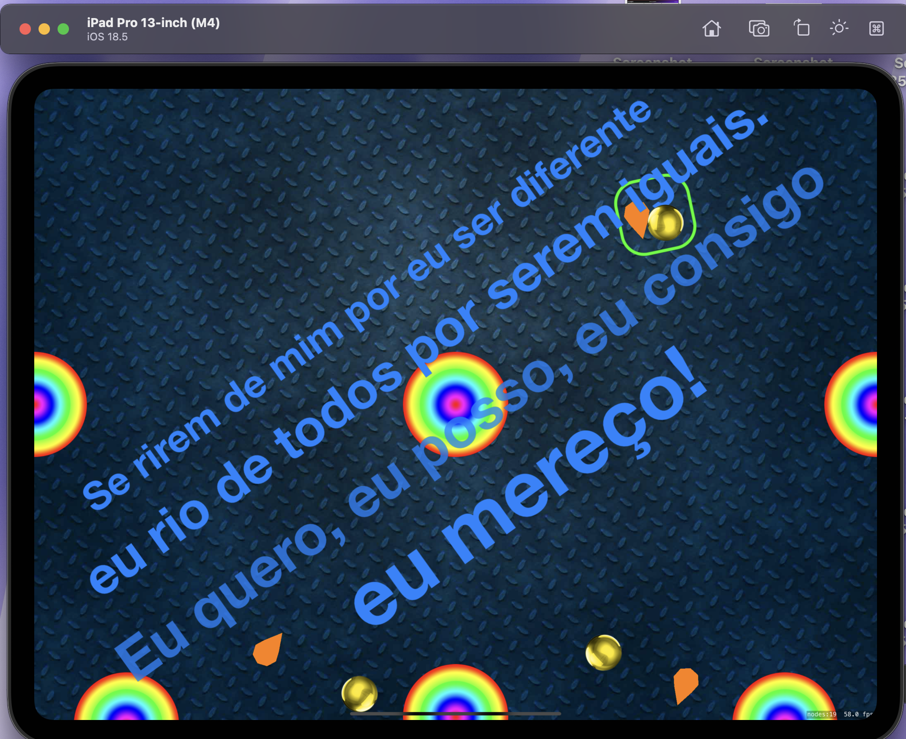
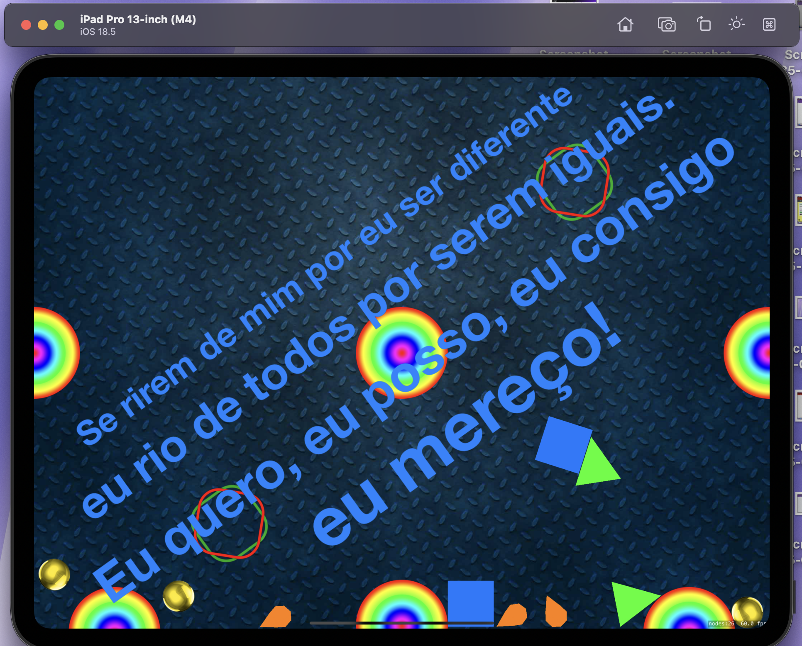

🌸❤️

````markdown
# 🎯 Physics Playground com SpriteKit

Pequeno projeto interativo desenvolvido em **Swift** utilizando **SpriteKit** baseado no www.hackingwithswift.com projeto 11, onde formas geométricas aparecem e interagem com física realista.
Toques simples ou duplos na tela criam diferentes objetos que caem, quicam e interagem com elementos fixos, usando as ferramentas nativas do SpriteKit.

---

## ✨ Funcionalidades

- **Toque único** → Gera **bolas** e **cones** com física realista
- **Toque duplo** → Gera **triângulos** e **quadrados**
- Objetos fixos (*bouncers*) no cenário, que fazem as formas quicarem
- Gravidade e colisões aplicadas com `SKPhysicsBody`
- Detecção de toques usando `touchesBegan` e `tapCount`
- Imagens carregadas diretamente do **Assets**

---

## 📦 Pré-requisitos

- Xcode **15+**
- Swift **5.9+**
- macOS **Ventura** ou posterior

---

## 🚀 Como Executar

```bash
# Clone o repositório
git clone https://github.com/AnaTertu/devSwiftJourney/

# Abra o projeto no Xcode
open a100DaysOfSwift/Peggle_Pachinko_SpriteKit

# Rode no simulador ou dispositivo
````

---

## 📸 Demonstração

| Toque único                  | Toque duplo                       |
| ---------------------------- | --------------------------------- |
|  |  |

---


---
## 🔮 Melhorias Futuras

* Adicionar **sons** de colisão
* Criar **efeitos de partículas** ao quicar
* Adicionar pontuação ao tocar em áreas específicas
* Alterar cores e formas dinamicamente

---

## 📝 Licença

Este projeto está sob a licença MIT — sinta-se livre para usar e modificar.

---

💡 *Projeto criado para estudos de física no SpriteKit, explorando interação, toques e efeitos visuais.*
